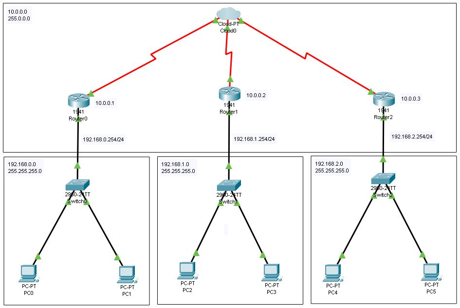
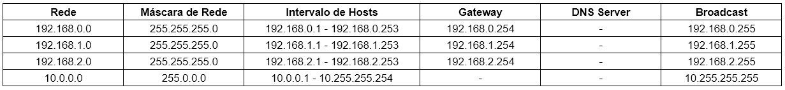

# Projeto de rede utilizando 3 roteadores, 3 switchs, 6 PC e CLOUD - CISCO Packet Tracer

## Contextualização

Neste projeto, foram configuradas quatro redes distintas: três delas destinadas a conectar os hosts aos seus roteadores correspondentes, e uma quarta rede projetada para a interconexão dos três roteadores com a CLOUD. Cada rede teve sua distribução de hosts feitas através de um switch interno.
Foram introduzidos e aplicados os conceitos de iPv4, Redes, Máscaras de rede, Broadcast, PDU, CLOUD, Roteamento Estático e Frame Relay.

## Lista dos componentes

- 3 Roteadores 1941
- 3 Switchs 2960-24TT
- 1 CLOUD-PT
- 6 PC-PT

## Projeto Lógico

## Tabela de endereçamento de IP

## Arquivo pkt

https://drive.google.com/file/d/15MIHMLZzwP8azE332vjDaSJsd4wlxi2j/view?usp=sharing
